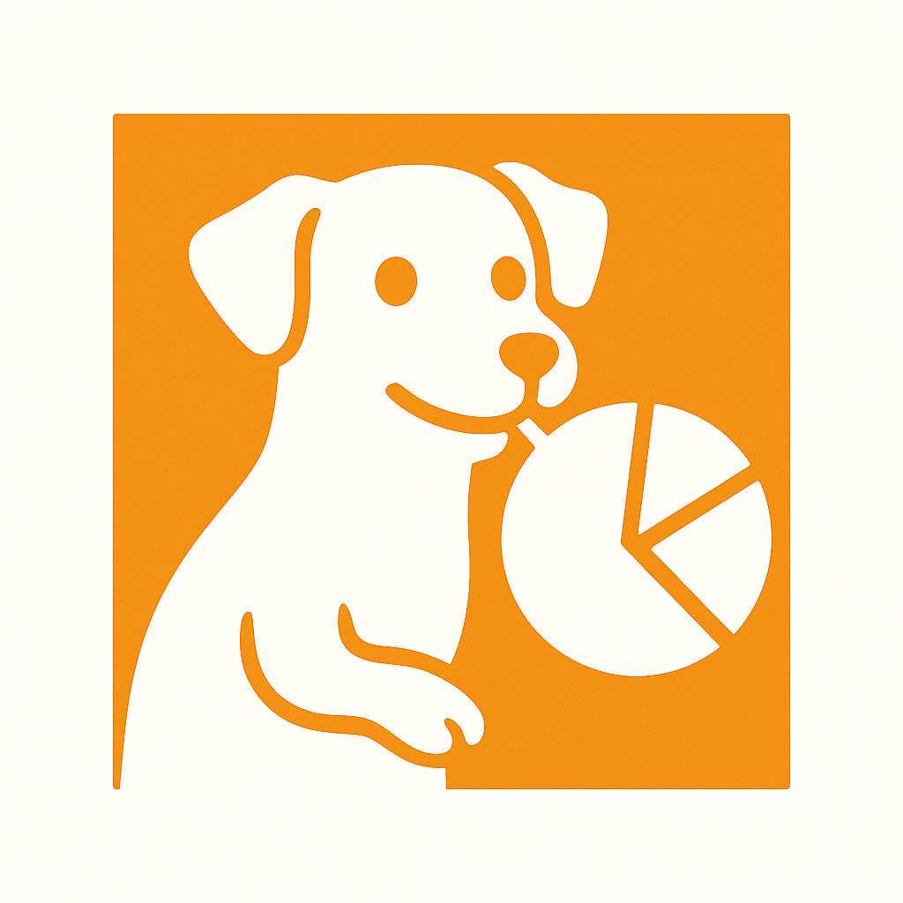

# LocalDog

LocalDog é um ambiente local para desenvolvimento e validação de métricas no padrão DogStatsD, inspirado no Datadog. Ideal para simular, visualizar e verificar métricas customizadas sem precisar usar a plataforma real.

🚀 Funcionalidades

🎧 Receptor UDP (porta 8125) no formato DogStatsD

📊 Armazenamento em memória das métricas

🌐 Dashboard local em http://localhost:8080

🧠 Análise de cardinalidade de tags

🔍 Separação entre tags de alta e baixa cardinalidade com proporção baseada em volume

🔁 Reset de métricas com DELETE /reset

📦 Instalação

git clone https://github.com/seuusuario/localdog.git
cd localdog
go mod tidy
go run main.go

📤 Enviando Métricas

Você pode usar echo + netcat:

echo "signup.completed:1|c|#user_id:123,env:dev" | nc -w 1 -u localhost 8125

Ou use uma biblioteca como hot-shots (Node.js) ou java-dogstatsd-client.

🧪 Testando

Acesse http://localhost:8080 para ver as métricas recebidas.

Veja as métricas ordenadas por cardinalidade em: http://localhost:8080/cardinality

📑 Endpoints

Método

Rota

Descrição

GET

/

Dashboard local

GET

/metrics

Todas as métricas registradas

DELETE

/reset

Zera as métricas

GET

/cardinality

Report de cardinalidade (JSON)

📋 Exemplo de Saída (/cardinality)

[
  {
    "metric": "signup.completed.user_id",
    "tag_key": "user_id",
    "unique_values": 123,
    "total_samples": 123,
    "cardinality_pct": 1.0
  }
]

🧱 Arquitetura

main.go: inicializa o listener e servidor HTTP

statsd/: parser UDP DogStatsD

storage/: armazenamento e cálculo de cardinalidade

api/: handlers HTTP

📃 Licença

MIT License.

✨ Futuro

Exportação CSV

Persistência opcional com SQLite

Alertas e limites configuráveis

Auto-refresh na UI

Dockerfile para facilitar o uso

Contribuições são bem-vindas! Abra um PR 🛠️

